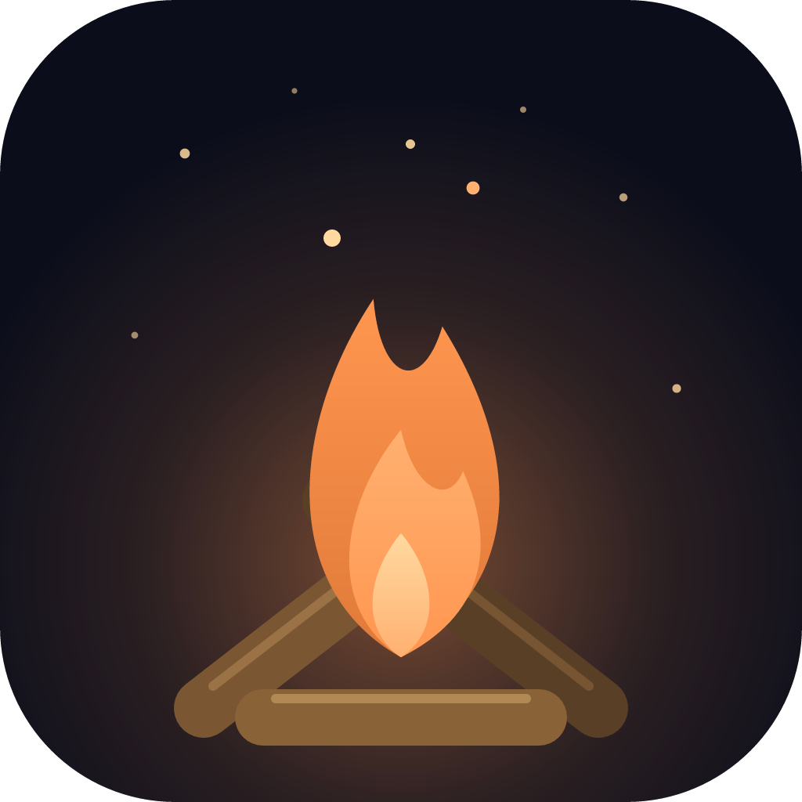

<p align="center">
  
</p>

<h1 align="center">La Fogata</h1>

<p align="center">
  <em>A campfire for hard nights.</em><br />
  <a href="https://app.lafogata.workers.dev">Sit by the fire</a> · <a href="README.md">Español</a>
</p>

---

There are nights when what weighs on you doesn't fit into a conversation. You don't want to explain it to anyone, but you don't want to be alone either. La Fogata is a place for those nights.

You sit by a fire, at night, in the woods. Other people sit with you, always anonymous: they are animals, not profiles. Nobody talks. They keep each other company.

## What you can do

There are only three gestures, and that is on purpose.

- **Throw wood.** The fire grows with every log and slowly dies down on its own. Everyone sitting with you sees it.
- **Hand over a burden.** You write what weighs on you and the fire burns it. What you write never leaves your browser: it isn't sent, it isn't stored, and nobody reads it, not even me.
- **Leave an ask.** It rises with the smoke and becomes a star in the sky. Leave as many as you like. When it comes true, you go back to your star and tell how it happened.

And two more things: touch the fire to receive a few short words, and touch someone else's star to tell them, with a fish, that you are with them. Without knowing who they are. Without them knowing who you are.

## What La Fogata will never have

Chat. Direct messages. Profiles. Likes. Streaks. Rankings.

It is not a social network and doesn't want to be one. Nothing in it asks you to come back: it is there when you need it.

## Your privacy

- No accounts, no email, no name. The app doesn't store your IP.
- **Burdens** stay in your browser and are gone once burned.
- An **ask** is different: it is a star other people can see. So it is going to be kept on the server (today it still lives only in your browser, while the page is open). It will be public and anonymous: whoever runs the server will be able to read its text, but not who wrote it. Only a fingerprint of the secret key your browser keeps to recognize your stars will be stored; the key itself will never leave it.
- Every text goes through a filter before it is shown. And if what you write shows signs that you are in danger, nothing is published: a help screen appears.

## Why it exists

I made it because I believe keeping someone company doesn't need pretty words or solutions: sometimes it is enough to know you are not the only person awake.

It doesn't replace a professional or the people who love you. If you are going through something very hard, please reach out: [findahelpline.com](https://findahelpline.com) lists support lines in almost every country.

## Where it stands

This is the first version. What already works: the campfire, the animals, the wood and the burdens everyone sees, the stars, the turning sky, the word from the fire and the sound. Each campfire seats up to seven people, and when one is full you join another: nobody waits.

What comes next: asks kept for good, one shared sky for everyone (today each person sees only their own), and seeing, far off between the trees, the other campfires in the forest.

## Run it on your computer

You need Node 22 or newer and pnpm.

```sh
corepack enable
pnpm install
pnpm dev
```

The web is at `http://localhost:3000` and the realtime server at `http://localhost:8787`. Open the web from your phone, on the same network, at `http://<your computer's address>:3000` and you will see the people from both devices at the same fire. No account or credentials needed.

## Run your own campfire

The code is free: anyone can set up their own, on a free Cloudflare account. The steps, and where each secret lives, are in [docs/DEPLOY.md](docs/DEPLOY.md).

## Helping

If you want to help, you are welcome. Read the [contributing guide](CONTRIBUTING.md) and the [code of conduct](CODE_OF_CONDUCT.md) first. If you find a security problem, report it as [SECURITY.md](SECURITY.md) says and not in a public issue.

The important decisions are explained in [docs/decisions](docs/decisions), and how it is all put together in [docs/ARCHITECTURE.md](docs/ARCHITECTURE.md).

## License

[MIT](LICENSE). Use it, change it and share it.
