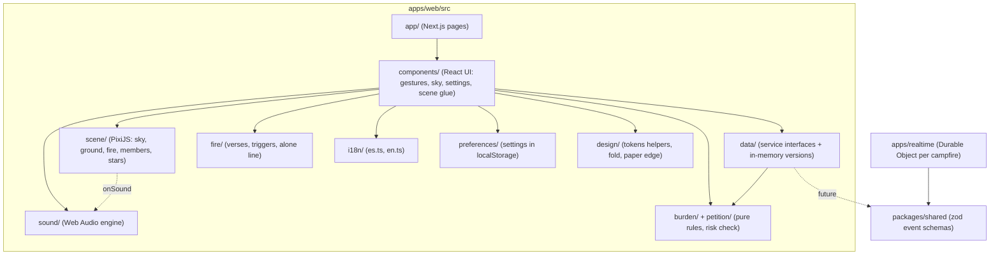

# Architecture

La Fogata is a pnpm + Turborepo monorepo. Today everything runs in the browser against in-memory services; the realtime server and the database arrive in phases 3 and 4 behind the same interfaces (see `docs/decisions/0001-in-memory-services-first.md`).

## Module map

Rules of thumb:

- `scene/` knows how to draw and animate. It never reads services and never knows what a person wrote.
- `data/` knows rules and state. It never touches Pixi or the DOM.
- `components/` is the glue: it subscribes to services and calls scene methods. No per-frame work in React; the sky's buttons are moved through refs.
- Everything user-facing comes from `i18n/`.
- Known inversion to clean up: `data/` currently imports a few helpers from `scene/` (wood cooldown, `pickArrival`, random, math).

## Data flow: services → React → scene

1. `DataProvider` creates the services (`presence`, `fire`, `petitions`, `distantFires`) from `data/index.ts`.
2. `FogataScene` (a component) builds the Pixi scene, then subscribes to the services and translates their events into scene calls (for example `fire.subscribe` → `scene.throwWood(by)`, `presence.subscribe` → add, remove or replace a member).
3. The scene reports what happened visually back out through `scene.onSound`, `onSettled` callbacks and view events. `SoundProvider` listens to `onSound` and plays a synthesized cue. Only the kind of event goes out, never text.
4. Visitors act through components (`GestureBar`, the star cards, settings), which call services; the services emit events; step 2 repeats for everyone at the fire.

## How a gesture travels end to end

**Throw wood**

1. `GestureBar.throwWood` calls `fire.throwWood()`.
2. `MemoryFire` checks the per-person cooldown (`WOOD_COOLDOWN_SECONDS`) and, if free, emits `{ type: "wood", by }`.
3. `FogataScene` receives it and calls `scene.throwWood(by, …)`: the member swings, a log flies, the fire flares and its fuel rises (`scene/fuel.ts`).
4. The scene emits the `wood` sound event; `SoundProvider` plays the thump.

**Hand over a burden** (browser only)

1. `BurdenDialog` collects the text. `GestureBar.begin` only runs `hasRiskSignals(text)` and keeps a boolean. The text never goes to a service, the scene, an event or storage.
2. `FoldingNote` folds the paper and flies it to the animal's paws (`scene.notePlacement`). The scene takes a blank note.
3. `scene.handOverBurden(id, { onDone, onSettled })` runs the errand (`errand.ts`, `walk.ts`), the note burns (`noteEffects.ts`, `noteBurn.ts`), a light rises and becomes a shooting star.
4. `onDone` frees the gestures; `onSettled` later lets the fire speak. A risky text opens the help screen instead of being published anywhere.

**Leave a petition**

1. `PetitionDialog` → `GestureBar` runs the risk check, then `petitions.create(text)` (moderation lives behind this call).
2. The sky turns to the visitor's constellation; a light rises from the fire and a star is born at its constellation spot (`scene/constellation.ts`, `petitionStars.ts`).
3. The star is a real button in `PetitionSky`; its card, answer, return-to-fire and the ichthys counter all go through `petitions`.

## How to add things

**A gesture**: define the result and event types and the method in `data/types.ts`; implement them in the in-memory service and add a test in `data/`; add the scene method on `FogataScene` (`scene/createScene.ts`) with its reduced-motion path; subscribe in `FogataScene.tsx`; add the trigger in `components/gestures/`; add a sound event; add strings; run the definition of done (`.claude/skills/definition-of-done`).

**A string**: add the key to `apps/web/src/i18n/es.ts` and `en.ts` (same key; English is natural and warm, never says "petition"). Use `plural()` for counts and `format()` for placeholders. Never hard-code text in a component or the canvas.

**A sound**: add the event name to `SoundEvent` and its cue to `CUES` in `sound/soundEvents.ts` (gain below `ONE_SHOT_MAX_GAIN`, a priority, a duration, a `minGap`); add or reuse a voice in `sound/voices.ts`; have the scene emit it through `onSound`; add a test in `soundEvents.test.ts`. Levels live in `sound/levels.ts`.

**A scene effect**: put it in its own file under `scene/` (for example `woodEffects.ts`); allocate textures and graphics once, reuse them, and destroy them in the effect's `destroy`; add it to the scene's ticker only while active; give it a reduced-motion variant (`scene/motion.ts`); keep the pure planning in a testable function with a test next to it.
